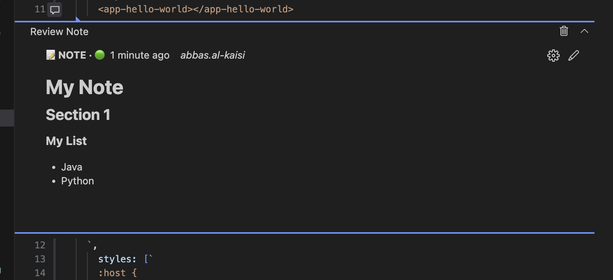
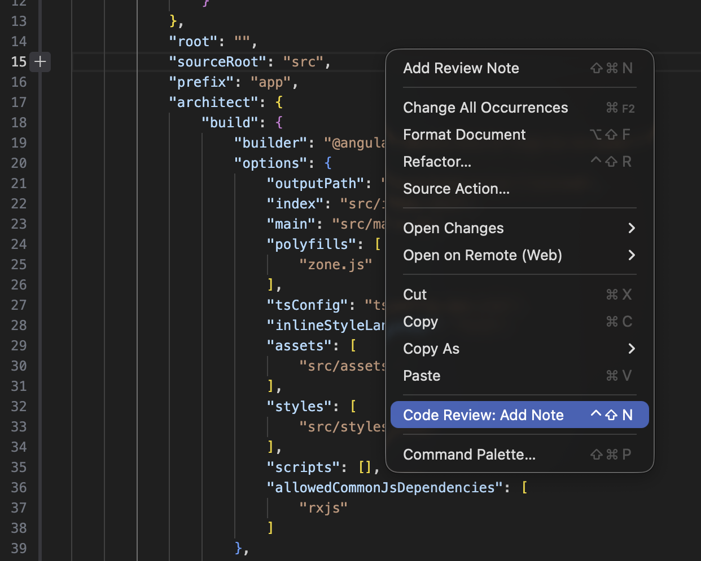
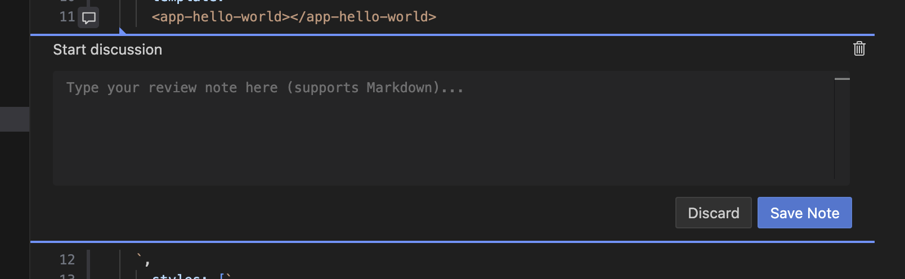
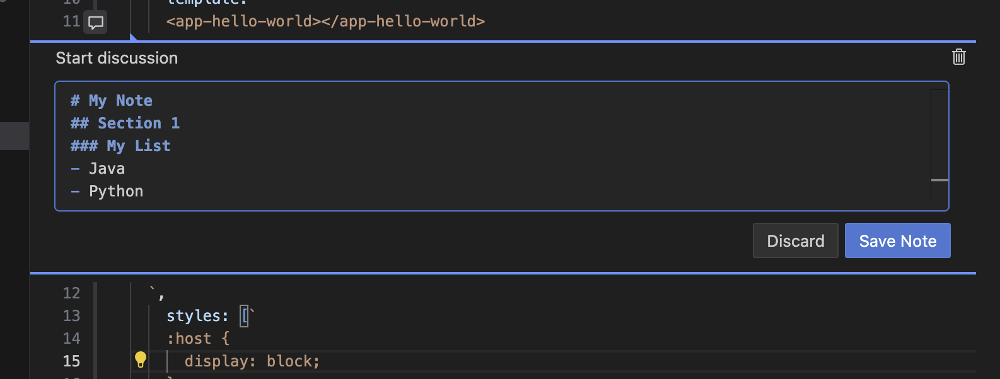
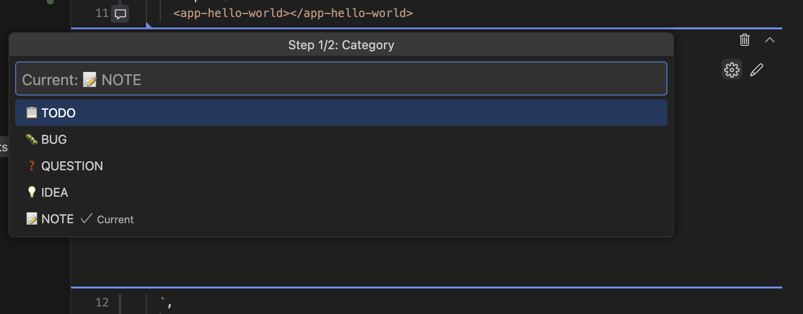
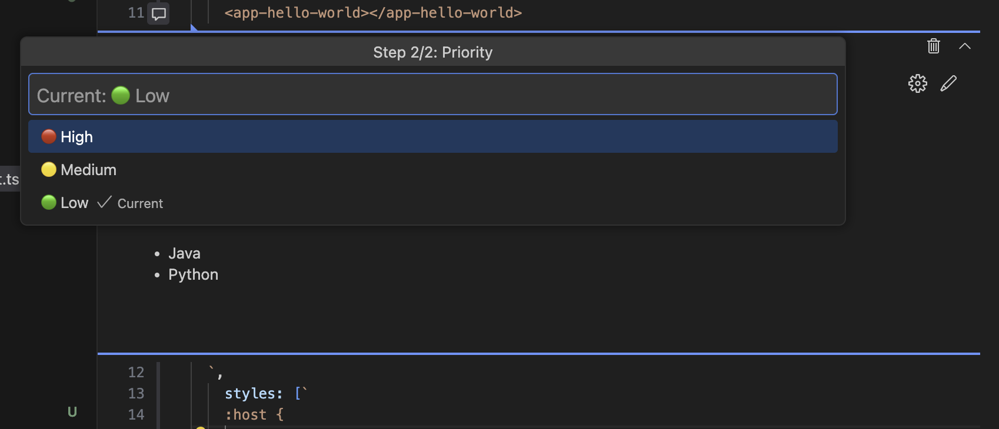
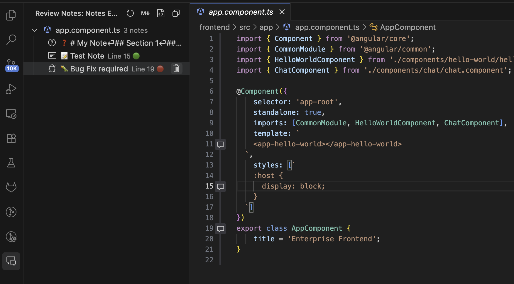
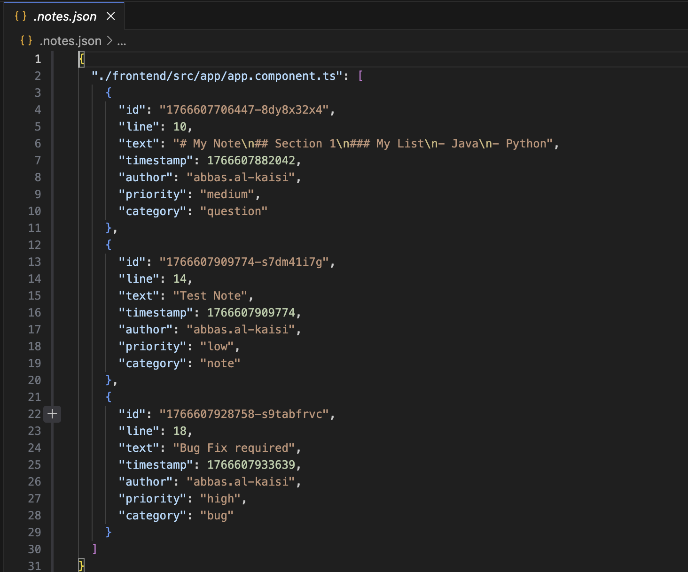

# Review Notes

> Add local code review notes to your files without modifying source code — like commenting in Word or Bitbucket, but entirely local.

## ✨ Overview

**Review Notes** allows you to annotate your code with rich comments, similar to a Pull Request review, but stored locally in a separate JSON file (`.notes.json`). This means you can add TODOs, questions, bugs, and ideas without cluttering your actual source code.

## � Usage

### 1. Adding Notes

You can add a note to any line of code in three ways:
1. **Right-click** on a line and select **"Add Review Note"**.
2. Click the **+** icon in the editor gutter (margin).
3. Use the keyboard shortcut: `Ctrl+Shift+N` (Mac: `Cmd+Shift+N`).

Once triggered, a comment widget will appear. Type your note (Markdown is supported!) and click **Add Review Note**.

### 2. Editing Notes

Need to change the text? Just click the **pencil icon** on any existing note to edit its content.

### 3. Changing Category and Priority

Organize your notes by assigning categories and priority levels.
- **Categories**: 📋 TODO, 🐛 BUG, ❓ QUESTION, 💡 IDEA, 📝 NOTE
- **Priorities**: 🔴 High, 🟡 Medium, 🟢 Low

You can change these properties easily via the edit menu on the note.

### 4. Viewing All Notes (Tree View)

See a comprehensive overview of all your notes across the entire project in the **Review Notes Explorer** sidebar. Click on any note to jump directly to that line in the code.

### 5. Deleting Notes

You can delete notes either directly from the **comment thread in the editor** or by clicking the trash icon in the **sidebar explorer**.

### 💾 How it Works

Your notes are **NOT** written into your source code files. Instead, they are safely stored in a separate `.notes.json` file in your workspace root.

This keeps your codebase clean while preserving all your review data.

**Sharing:**
- **Private:** Add `.notes.json` to your `.gitignore` to keep notes to yourself.
- **Team:** Commit `.notes.json` to your repository to share notes with your team.

---

## ⌨️ Shortcuts

| Shortcut | Command |
|----------|---------|
| `Ctrl+Shift+N` | Add Review Note at cursor |

## 🤝 Contributing

Contributions welcome! Submit issues or pull requests on [GitHub](https://github.com/aikaisi/review-notes).

## 📄 License

[MIT](LICENSE) © Abbas Al-Kaisi
